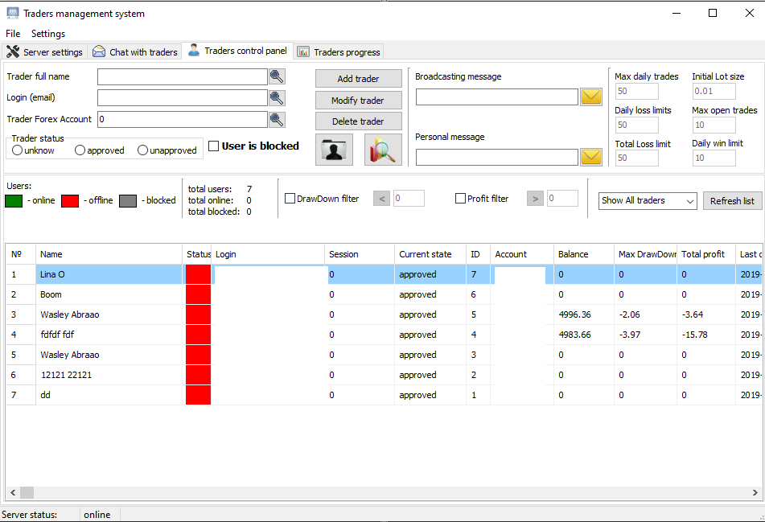
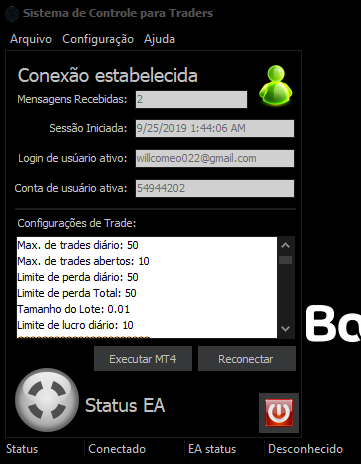
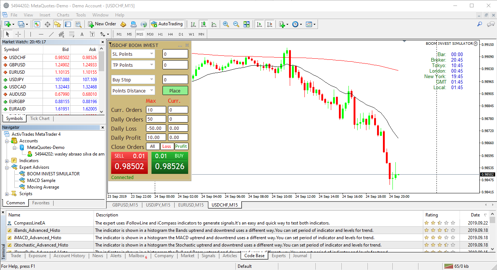

# Metatrade-Strategy-Management-System
This project is for management several MT4/MT5 Accounts Trading.
[![NPM Version][npm-image]][npm-url]
[![Build Status][travis-image]][travis-url]
[![Downloads Stats][npm-downloads]][npm-url]

## My Project is constructed with 3 part.
1. Expert Advisor of MT4 -> EX4
2. MTApi Controller -> BusinessTerminal
3. Business Management System -> Server
## Server


## Client

## Broker EA


## Installation

OS X & Linux:

```sh
dotnet run
npm start
```

Windows:

```sh
dotnet run
npm start
```

## Usage example

> In this project.
> System Manager will control all Registered Accounts and Will provide good strategy.
> So You have to install this Server to VPS.

## Development setup
1. Visual Studio 2017 (ASP.NET.CORE, C#)
2. NodeJS

```sh
npm install
```

## Meta

> If you have some problem when you use this system, Please contact me to follow Address.

Skype -> live:force.top_1

Email -> willcomeo022@gmail.com

Freelancer -> https://www.freelancer.com/u/xiqian88?w=f
